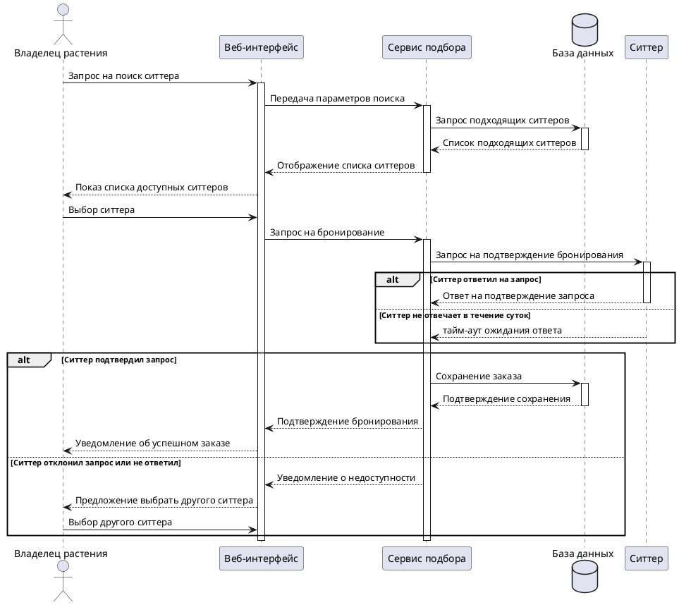

Sequence diagram

## Описание алгоритма

1. **Owner** отправляет запрос на поиск ситтера по определнным параметрам.
2. **System** обрабатывает данные и выдает список похдходящий под параметры ситтеров.
3. **Owner** выбирает ситтера из полученного списка и отправляет запрос на бронирование.
4. **System** обрабатывает выбор клиента и направляет запрос на подтверждение бронирования ситтеру.
   - Если ситтер подтвердил бронирование:
     - **System** сохраняет данные в **Database**.
     - **System** отправляет **Owner**: `Уведомление об успешно созданном бронировании`.
   - Если ситтер отклонил бронирование или не отвечал:
     - **System** отправляет **Owner**: `Уведомление о недоступности ситтера`.