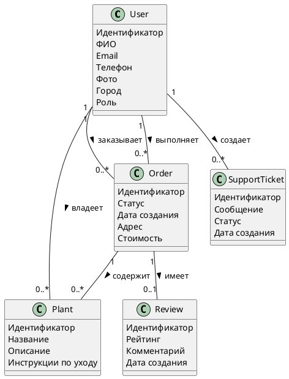

# Концептуальная схема модели данных

```plantuml

@startuml Концептуальная схема
!define ENTITY class

ENTITY User {
  Идентификатор
  ФИО
  Email
  Телефон
  Фото
  Город
  Роль
}

ENTITY Plant {
  Идентификатор
  Название
  Описание
  Инструкции по уходу
}

ENTITY Order {
  Идентификатор
  Статус
  Дата создания
  Адрес
  Стоимость
}

ENTITY Review {
  Идентификатор
  Рейтинг
  Комментарий
  Дата создания
}

ENTITY SupportTicket {
  Идентификатор
  Сообщение
  Статус
  Дата создания
}

User "1" -- "0..*" Plant : владеет >
User "1" -- "0..*" Order : заказывает >
User "1" -- "0..*" Order : выполняет >
Order "1" -- "0..*" Plant : содержит >
Order "1" -- "0..1" Review : имеет >
User "1" -- "0..*" SupportTicket : создает >

@enduml


```

## Описание сущностей

*текстовое описание сущностей*